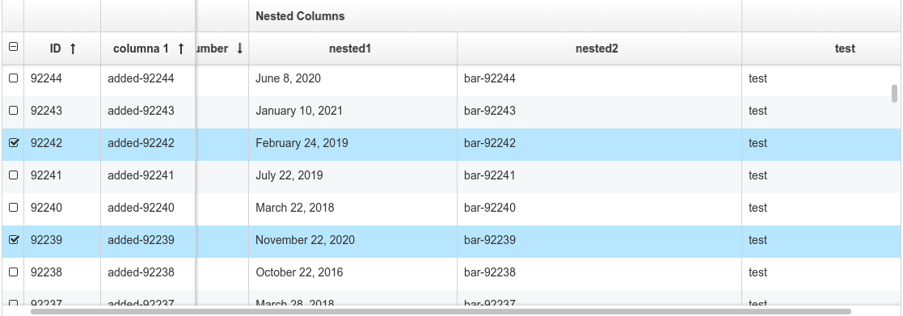

# ProperTable

[](https://travis-ci.org/CBIConsulting/ProperTable)

A Proper data table for React based on famous fixed-data-table from Facebook. This components add some functionality to the react-data-table of Facebook. The table was designed to handle thousands of rows of data without sacrificing performance even when it's sorted by some different columns at the same time.

The component is heavily opinionated and requires some external dependencies to be used in the browser.

Used technologies:

- React
- ES6
- Webpack
- Babel
- Node
- Compass
- Jasmine
- Karma

Features of ProperTable:

* Fixed Column/s on scrolling
* Rows selection with callback (return selected rows data and the id's)
* Sorting (single column, multiple column sorting)
* Cell Formating
* Column Resizing (Fill the container, if the content is bigger than the container then show a horizontal scrollbar)
* The visibility of each column could be updated in hot.
* Default Sorting allowed
* Default Selected rows allowed
* Apply filters / sort to internal data using the colFilters and colSortDirs properties in a easy, fast and clean way.
* Allows to use a custom filter component for each column, rendered in column header after header icon get clicked. (Uses a custom Portal to render based on [React Portal](https://github.com/tajo/react-portal))
* From FixedDataTable:
  * Fixed headers and footer
  * Both fixed and scrollable columns
  * Handling huge amounts of data
  * Variable row heights (with adaptive scroll positions)
  * Column resizing
  * Performant scrolling
  * Customizable styling
  * Jumping to a row or column
  * Controlled scroll API allows touch support

The compiled and compressed ProperTable distribution file can be found in the dist folder along with the css file. Add the default stylesheet `dist/propertable.min.css`, then import it into any module.

## Live Demo
##### [Code](https://github.com/CBIConsulting/ProperTable/tree/gh-pages/examples/jsx/example.js)
##### [Demo](http://cbiconsulting.github.io/ProperTable/)

##External dependencies
* React and React DOM
* Underscore
* moment

## Preview



## How to start

Run:
```
npm install
npm start
```

Check your http://localhost:8080/ or  `open http://localhost:8080/`

## How to test

`npm test`

### Component properties

* cols: Describe columns data. (Array)
	* Mandatory properties:
	 	* name: Internal name. Must be unique.(String)
	 	* field: Describe field data. {id, number, nestedField...} (String)
	 	* label: Label in the column header. Could be an html tag, a string (in this cases uses a FixedDataTable Cell)...
	* Optional properties:
	 	* fixed: If the column is fixed on horizontal scroll or not (Boolean) Default false
	 	* className: CSS class to add on columns header and each cell.(String)
	 	* width: Column width. (Integer) Default 100
	 	* maxWidth: Max. width in numeric. (Integer) Default infinite
	 	* flexGrow: Same as flexgrow of FixedDataTables. But this works only when the width and maxWidth are undefined or null. (Integer)
	 	* sortable: If the column is sortable or not (Boolean) Default true
	 	* uniqueId: An unique id for the Column. (Integer)
	 	* isResizable: If the column is resizable. (Boolean) Default true
	 	* isVisible: If the column must be rendered. (Boolean) Default true
	 	* formatter: Parser for the cell data before render. WARNING! When you are using a complex filter component for cell header (read down), you must be carefull of the formatter because the data for filter sometimes has to be formated then it should be a string or number. The solution is that you ill get just only the first parameter and the other's will be null, so you can return a string (for filtering, show in filter, etc) when you get a null in the second and third parameter (Function)
	 		* Ex:
	 		```javascript
				formatter: function(value) {
					return ProperTable.formatters.number(value+1);
				}
			```
		* sortVal: Parser for the column cells before sort. (Function)
			* Ex:
			```javascript
				sortVal: function(value) {
					return value.toString();
				}
			```
		* align: Alignment of the column. (Default center)
		* children: Children column of the current column. Should have the same structure as a column. Each column can have multiple childrens (Array)
* data: Data of the table (Array)
* afterSort: Function called after the data has been sorted. Return the raw data sorted.
	* Ex:
	```javascript
		afterSort={function(data) {
			console.log('Sorted data: ', data);
		}}
	```
* afterSelect: Function called after select a row. Return the seleted rows.
	* Ex:
	```javascript
		afterSelect={function(data, selection) {
			console.log('Selected rows: ', data);
			console.log('Selected row ids: ', selection);
		}}
	```
* onScrollStart: Callback that is called when scrolling starts with current horizontal and vertical scroll values.
* onScrollEnd: Callback that is called when scrolling ends or stops with new horizontal and vertical scroll values.
* selectable: If the rows (all table) can be selected or not and if that selection is multiple. Values: True || 'Multiple' || False
* rowHeight: Height of each row in numerical value. (Integer)
* lang: Lang of the component. Default 'ENG'
* selectorWidth: Width of the selector column, checkboxes. (Only if selectable is multible)
* colSortDirs: Sort direction of each column, to be applied to the table, indexed by column name. That's usefull to sort the table by sending which column must be sorted, it's faster and easier than sort data outside and then send it to the component, because in that case the data must be procesed for internal working. Values (ASC, DESC, DEF) (DEF -> Default)
	* Ex:
	```javascript
		{
			column_1: 'ASC',
			column_5: 'DESC'
		}
	```
* colFilters: Filters for each column indexed by column name. Works like the internal column filter, the keys are the names of the each column. It's highly recomended to use this property instead of apply a filter over data outside and then send data to the component. It's an object which contain objects indexed by column name. By default the property type is 'selection' if it's undefined, then you cand send something like {columnName: {selection: [val1, val2]}}. The selection is an array of values of the column, makes a filter getting only the rows that match with that value in that column. When set type to 'operation' the operationValue and OperationType must exist, the operationType it's the filter type ('equals', 'contains'...) and the operationValue it's the value to compare with each value of the column. [See docs here...](https://github.com/CBIConsulting/ProperTable/tree/dev/docs/SETTINGS.md)
	* Ex:
	```javascript
		{
			column_1 : {
				type: 'selection', // 'selection' or 'operation'
				operationValue: 34, // Operation value. Ex: 'Jhon Snow'
				operationType: 'bigger', // Operation type. Ex: 'equals', 'contains'...
				selection: ['Jhon Snow', 'Jhon Smith', 'Walter White']
			},
			column_5 : {
				type: col.filterType,
				operationValue: col.operationFilterValue,
				operationType: col.operationFilterType,
				selection: col.selection
			}
		}
	```
* selected: Rows selected by default. Get an array of ids or an single id
* idField: Field that can be used as an id for the default selected rows.
	* Ex:
	```javascript
		const cols = [
			{
				name: 'id',
				label: 'ID',
				field: 'id',
				width: 50
			},
			{
				name: 'col1',
				...
		<ProperTable idField="id" selected={[3,5,23]}.../>
	```
* multisort: Multisort allowed or not. (Boolean)
* columnFilterComponent: React Component to be rendered on click column header icon. Gets data, sort, column selection... [HeaderCell](https://github.com/CBIConsulting/ProperTable/tree/dev/src/jsx/components/headerCell.js)
	* All data sent to the component:
	```javascript
		<props.filterComponent
		        data={props.data} // Initial data Inmutable
		        rawdata={props.rawdata} // Raw data Inmutable
		        indexed={props.indexed} // initial Indexed Obj (indexed by)
		        selection={col.selection}
		        idField={col.field} // Field used as primary key or id
		        displayField={col.field}
		        lang={props.lang}
		        sort={col.sortDir}
		        uniqueId={props.uniqueId}
		        rowFormater={props.formatter}

		        // Your component must have this functions, one that return the new column selection, other one that return the new sort direction
		        // and last one if you want a button to clean this column filter. The last one applys a selection and then the sort direction of the
		        // second parameter.

		        afterSelect={afterSelect} // function afterSelect(selectionArray);
		        afterSort={afterSort} 	  // function afterSort(sortDirection);
		        afterClear={afterClear}   // function afterSort(selection, sortDirection) -> afterClear([], 'DEF')
		 />
	```
* getColSettings: Function that get the column settings of the table. Each time the column settings changed (sort or filter of any column change) or get created then the function get the new settings. Name and field are the same as in Cols array, the selection field (selection of the column, array of filtered values of the column), direction ('DEF' *default || 'ASC' || 'DESC'), and other settings. Remenber that's a refenrence to an internal state, be very carefull. This property was thought to get the internal filters / sort data and show it externally (if you want to apply a change use the properties colSortDirs and colFilters). It's usefull when you have a filter component for the column and you want to have external filters aswell, then you can update the colSortDirs and colFilters externally (not causig a rerender)  [See docs here...](https://github.com/CBIConsulting/ProperTable/tree/dev/docs/SETTINGS.md)
	* Ex:
	```javascript
		getColumnSettings(colSettings) {
			console.log(colSettings);
		}
	```
* sortIcons: An array like the const SortIcons in HeaderCell file to use instead [HeaderCell](https://github.com/CBIConsulting/ProperTable/tree/dev/src/jsx/components/headerCell.js)
* iconColor: Color of the icon to open the column filter (if that exist) in the header of column. This color is used on open / filtered or sorted.
* iconDefColor: Color of the icon to open the column filter (if that exist) in the header of column. This color is used when filter component get close and the column is not filtered or sorted.
* restartOnClick: Restart the sort and filter (if the column has a Column Filter Component) of each column. It should be either a react element (in this case it has to have id (best) or className (add events to all elements with same class aswell)) or a Js element (JS element document.getElementById('btn')).
	* Ex:
	```javascript
		render() {
			let btnWithId, btnWithClassName, btnOutSide;
			btnWithId = <button  id='btn-clear' className="btn btn-primary" type="button"> Clear Filter & Sort</button>;
			btnWithClassName = <button className="btn btn-primary clear" type="button"> Clear Filter & Sort</button>;
			btnOutSide = document.getElementById('btn'); // An element rendered outside the current Component

			return (
				<div style={{width: '100%', height: '100%'}}>
					{btnWithId || btnWithClassName}
					<Table
						key={this.props.key}
						idField={this.props.idField}
						uniqueId={3}
						rowHeight={40}
						selectable={this.props.selectable}
						cols={this.props.cols}
						data={this.props.data}
						restartOnClick={btnWithId || btnWithClassName || btnOutSide}
					/>
				</div>
			);
		}
	```
* restartOnClickType: This prop allows you to set if you want the restartOnClick element to clear both (filters and sort) or just one of them. Default both. The options are 'clear_filters', 'clear_sort' or 'clear_both'.
* hasDisableRows: If this property is set to true (default false) then all the rows in the data that doesn't have a property Enabled or has Enabled = false will cause the row to has less opacity (disabled). Default false.
* displayFooter: If the footer must be displayed or not. The footer contains info about sort and filters. Default false.
* footerInfoHeight: If display footer then set the footer height to this value. Default 30px

### Basic Example
------------

```javascript
import React from 'react';
import ReactDOM from 'react-dom';
import ProperTable from 'ProperTable';

const cols = [
  {
    name: 'col1',
    label: <span>A number</span>,
    field: 'number',
    fixed: true
  },
  {
		name: 'nested',
		label: 'Nested Columns',
		children: [
			{
				name: 'nested1',
				label: 'nested1',
				field: 'nested1',
				sortable: false,
				sortVal: function(value) {
					return moment(value).unix();
				},
				formatter: ProperTable.formatters.date
			},
			{
				name: 'nested2',
				label: 'nested2',
				field: 'nested2'
			}
		]
	}
];

// Table data
const data = [];

for (var i = 10; i > 0; i--) {
  data.push({
    col1: 'col-' + i,
    nested1: '2016-05-16 02:00:0' + i),
    nested2: 'abc' + i
  });
}

// Render your table
ReactDOM.render(
  <ProperTable.Table
    key='TableKey'
    uniqueId={1}
    rowHeight={40}
    cols={cols}
    data={data}
    afterSelect={
      function(rows) {
        console.log('selected', rows);
      }
    }
    afterSort={
      function(data) {
        console.log('sorted data', data);
      }
    }
  />,
  document.getElementById('example')
);
```

Contributions
------------

Use [GitHub issues](https://github.com/CBIConsulting/ProperTable/issues) for requests.

Changelog
---------

Changes are tracked as [GitHub releases](https://github.com/CBIConsulting/ProperTable/releases).

